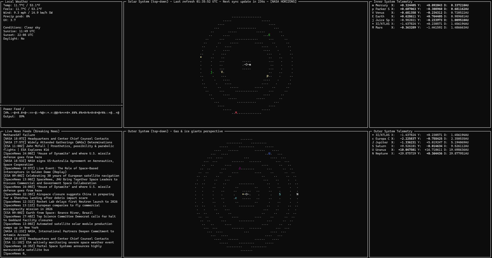
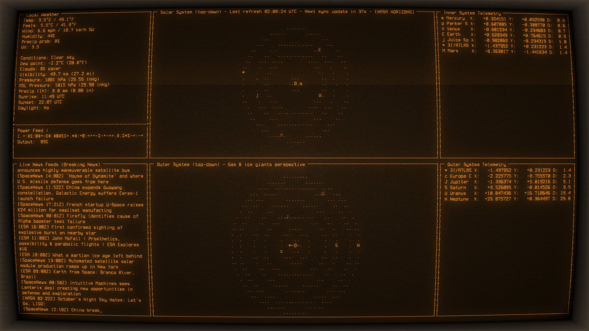

# LoFi dashboard for idle machines or terminals

A real-time terminal dashboard for monitoring solar system positions, local weather, and space news feeds. Built with Python and curses for a retro terminal aesthetic.

_Note: 80% AI Generated Code 🤖_



## Features

### Four-Panel Layout

- **Top-Left: Local Weather Panel**
  - Real-time weather data from Open-Meteo API
  - Animated bar gauges for temperature, wind, humidity, and more
  - Scrolling power status bar with ASCII texture animation
  - Displays conditions, pressure, visibility, precipitation, and UV index

- **Top-Right: Inner Solar System Chart**
  - Real-time positions of Mercury, Venus, Earth, and Mars
  - Tracks Parker Solar Probe and Juice Spacecraft
  - Displays comet 3I/ATLAS when in range
  - Logarithmic scaling for optimal visibility

- **Bottom-Left: Live News Feeds**
  - Aggregated headlines from NASA, ESA, and SpaceNews
  - Character-by-character ticker animation
  - Rolling history of recent headlines

- **Bottom-Right: Outer Solar System Chart**
  - Real-time positions of Jupiter, Saturn, Uranus, and Neptune
  - Tracks Europa Clipper spacecraft
  - Multi-scale visualization for gas and ice giants

- **Right Side: Telemetry Panels**
  - Inner and outer system telemetry displays
  - Real-time position coordinates (X, Y) and distance from Sun
  - Highlights changed values in bold for 1 second
  - Sorted by distance from the Sun

### Data Sources

- **Planet Positions**: NASA HORIZONS API for real-time ephemeris data
  - Falls back to calculated circular orbits if API is unavailable
  - Smooth interpolation between updates using velocity vectors
  - Updates every 5 minutes

- **Weather Data**: Open-Meteo API
  - Requires latitude/longitude coordinates via environment variables
  - Updates every 5 minutes

- **News Feeds**: RSS feeds from NASA, ESA, and SpaceNews
  - Updates every 5 minutes
  - Shuffled and limited to 40 items

## Requirements

- Python 3.7+
- `windows-curses` (Windows only) - install with: `pip install windows-curses`
- Standard library modules (no additional dependencies required)

## Installation

1. Clone or download this repository

2. Install Windows curses support (if on Windows):
   ```bash
   pip install windows-curses
   ```

3. (Optional) Configure weather location by creating a `.env` file:
   ```
   ALPHA_WEATHER_LAT=35.787743
   ALPHA_WEATHER_LON=-78.644257
   ```
   The app will search for `.env.local`, `.env.development`, or `.env` files in the current directory and parent directories.

## Usage

Run the dashboard:
```bash
python app.py
```

### Keyboard Controls

- **Q** or **q**: Quit the application
- **R** or **r**: Force immediate refresh of all data

### Environment Variables

- `ALPHA_WEATHER_LAT`: Latitude for weather data (decimal degrees)
- `ALPHA_WEATHER_LON`: Longitude for weather data (decimal degrees)
- `HORIZONS_DEBUG`: Set to `"true"` to enable debug logging for HORIZONS API

### Update Intervals

- **Synchronized Updates**: All components refresh together every 5 minutes (300 seconds)
- **Telemetry Updates**: Position interpolation updates every 0.5 seconds for smooth animation
- **News Ticker**: Character-by-character display at 50ms intervals

## Technical Details

### Orbital Calculations

- Uses mean longitudes referenced to J2000 epoch for circular orbit calculations
- Implements hyperbolic anomaly solver for comet 3I/ATLAS (hyperbolic orbit)
- Logarithmic radius scaling for optimal visualization of inner and outer systems
- Accounts for terminal character aspect ratio (0.5) for circular orbit display

### API Integration

- **NASA HORIZONS API**: Fetches state vectors (position and velocity) for planets and spacecraft
- **Open-Meteo API**: Free weather API with no API key required
- **RSS Feeds**: Parses XML feeds from multiple space news sources

### Color Support

- Automatically detects terminal color support
- Color-coded planets for easy identification:
  - Mercury: White
  - Venus: Yellow
  - Earth: Green
  - Mars: Red
  - Jupiter: Magenta
  - Saturn: Cyan
  - Uranus: Blue
  - Neptune: White
  - Comet 3I/ATLAS: Yellow
  - Spacecraft: Various colors

## File Structure

```
cool_term/
├── app.py              # Main application
├── requirements.txt    # Python dependencies
├── README.md          # This file
└── assets/
    └── screenshot.png  # Dashboard screenshot
```

## Troubleshooting

### Curses Import Error (Windows)

If you see `curses module not found`, install windows-curses:
```bash
pip install windows-curses
```

### Weather Not Displaying

1. Check that `ALPHA_WEATHER_LAT` and `ALPHA_WEATHER_LON` are set in your `.env` file
2. Verify coordinates are valid decimal degrees
3. Check internet connection (weather requires API access)

### Planet Positions Show "[calculated]"

- This means the NASA HORIZONS API is unavailable
- The app automatically falls back to calculated circular orbits
- Check internet connection and API availability
- Enable `HORIZONS_DEBUG=true` to see detailed error messages

### Terminal Too Small

- Minimum size: 60 columns × 16 rows
- Resize your terminal window if you see the "Terminal too small" message

## License

Part of the Alpha Assistant project.

## Credits

- Planet ephemeris data: NASA HORIZONS System
- Weather data: Open-Meteo (open-meteo.com)
- News feeds: NASA, ESA, SpaceNews

---

<a href="https://www.buymeacoffee.com/travin" target="_blank"></a>

I'm making use of https://github.com/Swordfish90/cool-retro-term on my workstation to give it a retro look.


